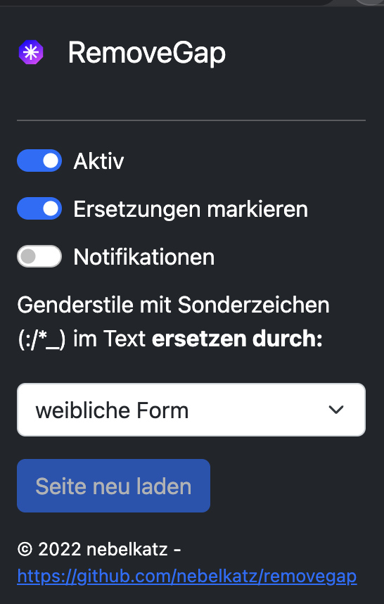
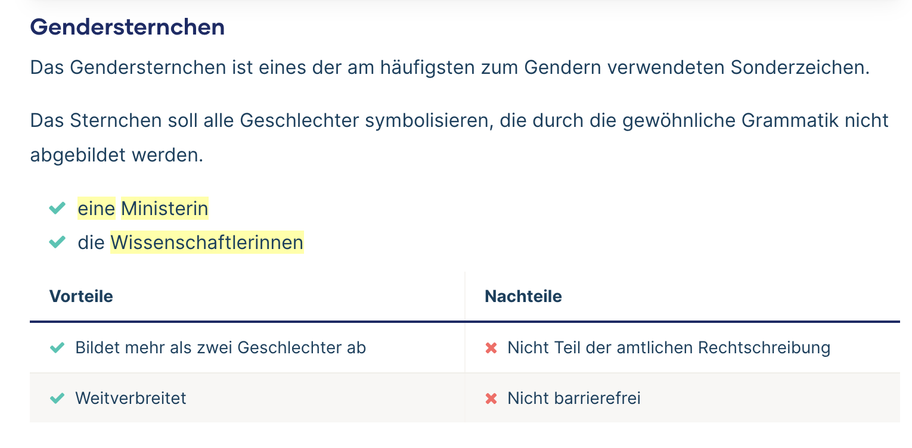

# RemoveGap
## Ausgangslage
Das Gendersternchen (*) ist eine der am weitesten verbreiteten Methoden, um gendergerecht zu schreiben. Dabei wird die männliche Form eines Wortes beibehalten und nach dem Sonderzeichen die weibliche Endung angehängt. So können sowohl Männer als auch Frauen berücksichtigt werden. Varianten davon sind die Verwendung von Doppelpunkt (:) und Unterstrich (_). Die Verwendung der Sonderzeichen soll dabei nicht nur Frauen und Männer in der Sprache gleich sichtbar machen, sondern auch alle anderen Geschlechter symbolisieren. Das unterscheidet es von anderen Formen des Genderns, beispielsweise mit dem Schrägstrich.

Obwohl die Verwendung des Gendersterns nicht von der amtlichen Rechtschreibung abgedeckt ist und weitere Nachteile mit sich bringt, ist es mittlerweile weit verbreitet und wird von einigen Hochschulen und Universitäten sogar vorgeschrieben.

## Browser Extension "RemoveGap"
Die Browser Extension für verschiedene Web-Browser ersetzt im Text der angezeigten Webseite die "Genderstile mit Sonderzeichen".  Dadurch wird der Lesefluss und die Barrierrefreiheit verbessert. Gleichzeitig können damit auch nicht Regelkonforme Genderformen wie beispielsweise "Kund:in" (vgl. [Weglassprobe](https://www.scribbr.de/category/richtig-gendern/)) beseitigt werden.

### Ersetzen durch gewünschte Form
Die gefundenen "Genderformen mit Sonderzeichen" können durch die männliche, weibliche oder paarweise Formulierung ersetzt werden.

### Markierung der Ersetzungen
Standardmässig werden die ersetzten Textpassagen markiert, um die Manipulation des Textes transparten zu machen. Dies kann in den Einstellungen angepasst werden.

## Funktionsweise
Die Extension nutzt das DOM um die Text-Knoten in der Seite zu traversieren. Es werden 7 verschiedene Regular Expressions angewendet, um die "Generstile mit Sonderzeichen" zu finden. Durch einen halbwegs ausgeklügelten Mechanismus werden in der Mehrzahl der Fälle die richtigen Ersetzungen gemacht.

Beispiel einer markierten Ersetzung im Browser:

## Einschränkungen
Es handelt sich um einen relativ einfachen Ersetzungsmechanismus, welcher schnell aus dem Konzept gebracht werden kann. Beispielsweise werden Genderstile, in welchen HTML-Auszeichnungen verwendet werden (bspw. Mitarbeiter&lt;strong&gt;*&lt;/strong&gt;in) nicht erkannt. Es ist auch nicht ausgeschlossen, dass es zu unvollständigen oder falschen Ersetzungen kommt.

## Testen
Die Erweiterung kann in der Regel im Developer-Modus lokal getestet werden. Dazu zuerst unter [Releases](https://github.com/nebelkatz/removegap/releases) die Zip-Datei des gewünschten Release und der Browser-Variante herunterladen.

### Firefox
1. In der Adresszeile `about:addons` eingeben
2. Rechts auf das Zahnrad-Symbol klicken und im Kontext-Menu 'Debug Addon' wählen
3. Auf der nächsten Seite (`about:debugging#/runtime/this-firefox`) die Schaltfläche __Temporäre Add-ons laden__ klicken
4. Die heruntergeladene xpi-Datei wählen
5. Das Add-on ist in der Toolbar des Browsers verfügbar.

### Google Chrome
1. Die heruntergeladene zip-Datei auf dem lokalen Laufwerk entpacken
2. In der Adresszeile des Browsers `chrome://extensions/` eingeben
3. Oben rechts im Fenster den `Entwickler Modus` einschalten. Darauf erscheinen rechts drei weitere Schaltflächen
4. Links im Fenster die Schaltfläche `Ungepackt laden` klicken
5. Den Ordner wählen, wo im Schritt 1 das ZIP entpackt wurde
6. Die Extension wird nun angezeigt und muss allenfalls noch aktiviert werden. Die Optionen sind unter dem Icon der Erweiterung unter dem Puzzle-Symbol im der Toobar des Browsers verfügbar.

### Microsoft Edge
1. Die heruntergeladene zip-Datei auf dem lokalen Laufwerk entpacken
2. In der Adresszeile des Browsers `edge://extensions/` eingeben
3. Rest wie bei [Google Chrome](#google-chrome)

Mit derinstallierten Extension auf die [Beispielseite](doc/beispiele.md) navigieren, welche verschiedene Beispiele enthält.

## Mitarbeit, Rückmeldungen
Hinweise, Verbesserungen und Anregungen und weitere Beispiele für die Testseite bitte per Issues und/oder pull requests.

## Artikel
- [Wie kam der * eigentlich in die Welt?](https://www.nzz.ch/feuilleton/gendersternchen-wie-kam-das-zeichen-in-die-sprache-ld.1715402) NZZ, 6.12.2022
- [Thema Gendersprache](https://www.nzz.ch/themen/gendersprache), NZZ
- [Gendersender](https://www.faz.net/aktuell/feuilleton/medien/ard-und-zdf-reagieren-nicht-auf-aufruf-gendern-zu-lassen-18511532.html), FAZ, 5.12.2022

## Referenzen
- Richtig Gendern, [Scribbr.de](https://www.scribbr.de/category/richtig-gendern/), November 2022
- Richtig Gendern, [Mentorium](https://www.mentorium.de/richtig-gendern/), November 2022
- Gendersternchen – Gendern mit * | Alle Regeln im Überblick [Scribbr.de](https://www.scribbr.de/richtig-gendern/gendersternchen/), November 2022
- [Universität Hamburg](https://www.uni-hamburg.de/gleichstellung/download/uhh-empfehlungen-kurversion.pdf)
- [Universität Bielefeld](https://www.uni-bielefeld.de/verwaltung/refkom/gendern/gendersternchen/)
- [Univesität Freiburg](https://www.gleichstellungsbuero.uni-freiburg.de/de/download/broschueren/Leitlinie%20geschlechtersensible%20Sprache.pdf)
- [Universität Hannover](https://www.chancenvielfalt.uni-hannover.de/de/schwerpunktbereiche/chancengleichheit/geschlechtergerechte-kommunikation)
- [Universität Rostock](https://www.uni-rostock.de/storages/uni-rostock/UniHome/Vielfalt/Vielfaltsmanagement/Toolbox/UEbersicht_gendern.docx.pdf)

## Abhängigkeiten
- [Boostrap 5.2](https://getbootstrap.com/), lizensiert unter der MIT Open Source Lizenz

Copyright 2022 nebelkatz

Licensed under the Apache License, Version 2.0 (the "License");
you may not use this file except in compliance with the License.
You may obtain a copy of the License at

http://www.apache.org/licenses/LICENSE-2.0

Unless required by applicable law or agreed to in writing, software
distributed under the License is distributed on an "AS IS" BASIS,
WITHOUT WARRANTIES OR CONDITIONS OF ANY KIND, either express or implied.
See the License for the specific language governing permissions and
limitations under the License.